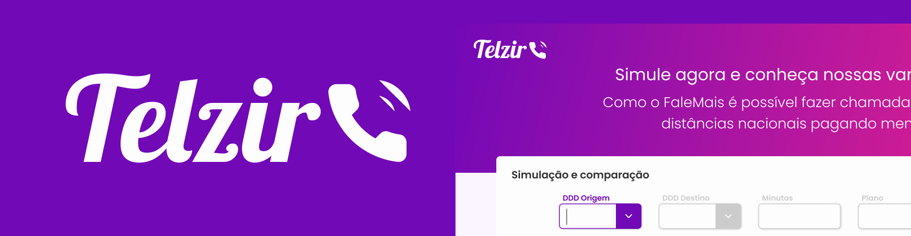

<p align="center">
  <a href="" rel="noopener">
 </a>
</p>

<h3 align="center">Telzir</h3>

---

<p align="center"> Projeto desenvolvido para o desafio da LOLDESIGN
    <br>
</p>

## 📝 Conteúdo

- [Sobre](#about)
- [Instalação](#install)
- [Tecnologias utilizadas](#built_using)
- [Autores](#authors)

## 🧐 Sobre <a name = "about"></a>
A aplicação tem como intuito resolver o case de uma empresa de telefonia fictícia chama Telzir.<br /><br />
Mais detalhes sobre o desafio: <br />
<a>https://www.loldesign.com.br/wp-content/uploads/2020/07/LOLDESIGN-showMeTheCode.pdf</a><br />

Design feito com [Figma](https://figma.com):<br />
<a>https://www.figma.com/file/nBx6PYxLPfNdZws4T732eK/Telzir?node-id=32%3A6</a>

## 🏁 Instalação <a name = "install"></a>

Faça o download do projeto em .zip ou utilize git caso esteja instalado na máquina:

```
git clone https://github.com/agustinhopneto/telzir.git
```

### Pré-requisitos

Para rodar o projeto é importante que tenha o [Node.js](nodejs.org) instalado na sua versão mais recente.

## ⛏️ Feito utilizando <a name = "built_using"></a>

- [NodeJs](https://nodejs.org/en/)
- [ReactJS](https://pt-br.reactjs.org/)
- [Typescript](https://www.typescriptlang.org/)
- [EsLint](https://eslint.org/)
- [Prettier](https://prettier.io/)
- [Styled Components](https://styled-components.com/)

## ✍️ Autor <a name = "authors"></a>

- [@agustinhopneto](https://github.com/agustinhopneto) - Design e código

